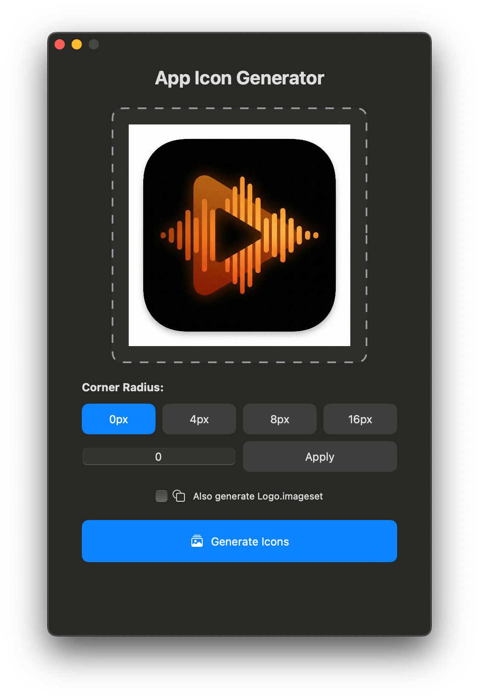
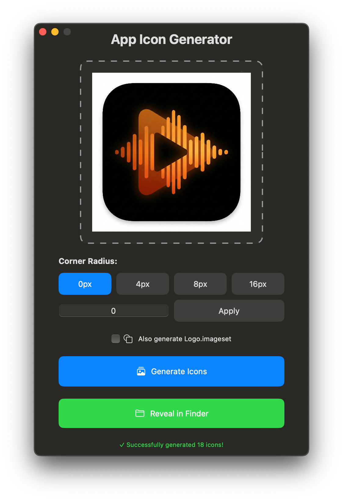

# App Icon Generator

A macOS app for generating iOS app icons from a single image with customizable corner radius.

## Latest Release: v1.1.0

### What's New
- ✅ **FIXED**: Correct icon pixel sizes (no more 2x size errors)
- ✅ **FIXED**: Icon-83.5@2x now properly included in Contents.json  
- ✅ **FIXED**: File picker dialog no longer appears multiple times
- ✅ **IMPROVED**: Pixel-perfect image resizing using NSBitmapImageRep
- ✅ **NEW**: Auto-override existing AppIcon.appiconset folders

[View full changelog](CHANGELOG.md)

## Screenshots

<table>
<tr>
<td><br/><em>Select your image and corner radius</em></td>
<td><br/><em>Generated icons ready for Xcode</em></td>
</tr>
</table>

## Features

- **Drag & Drop or Click to Browse**: Drag an image into the app or click the drop zone to select a file
- **Corner Radius Options**: Choose from preset values (0px, 4px, 8px, 16px) or enter a custom value
- **Auto-Generate All Sizes**: Creates all required iOS app icon sizes (iPhone, iPad, App Store)
- **Logo.imageset Generation**: Optional generation of Logo.imageset with selected corner radius
- **Reveal in Finder**: Quickly open the generated icon set folder
- **Contents.json**: Automatically generates the proper Contents.json file for Xcode

## Quick Start

### Build and Run the App

Simply run the build script:

```bash
./build_app.sh
```

This will:
1. Build the app in release mode
2. Create the app bundle with icon
3. Automatically open the app

Alternatively, you can double-click **"App Icon Generator.app"** to run it directly.

> **Note for first-time users:** If you see a security warning when opening the app, right-click (or Control+click) on "App Icon Generator.app" and select "Open". You'll only need to do this once.

## How to Use

1. **Double-click "App Icon Generator.app"** to launch
2. **Select an image**: Click the drop zone or drag and drop your source image (PNG, JPG, or JPEG)
3. **Choose corner radius**: Select 0, 4, 8, 16, or enter a custom value
4. **Optional**: Check "Also generate Logo.imageset" to create logo assets
5. **Click Generate Icons**: The app will create all required icon sizes
6. **Click Reveal in Finder**: Opens the output folder containing your AppIcon.appiconset

## Development

### Option 1: Using Swift Package Manager
```bash
swift run
```

### Option 2: Open in Xcode
1. Open the folder in Xcode
2. Select the AppIconGenerator scheme
3. Click Run (⌘R)

### Option 3: Build App Bundle
```bash
./build_app.sh
```

## Output

The app generates folders on your Desktop:

### AppIcon.appiconset
- All required iOS icon sizes (20pt to 1024pt)
- Proper @2x and @3x scales
- iPhone, iPad, and App Store variants
- Contents.json file ready for Xcode

### Logo.imageset (optional)
- Logo.png (60x60 @1x)
- Logo@2x.png (120x120 @2x)
- Logo@3x.png (180x180 @3x)
- Contents.json file ready for Xcode
- Same corner radius applied as selected

## Requirements

- macOS 13.0 or later
- Xcode 14.0 or later (for development)

## Generated Icon Sizes

- **iPhone**: 20pt, 29pt, 40pt, 60pt (@2x, @3x)
- **iPad**: 20pt, 29pt, 40pt, 76pt, 83.5pt (@1x, @2x)
- **App Store**: 1024pt (@1x)

You can simply copy the generated `AppIcon.appiconset` folder into your Xcode project's Assets.xcassets.

## Download

**[Download App Icon Generator v1.0](../../releases/latest)**

Extract the ZIP file and follow the README.txt instructions for first-time setup.

## Building from Source

If you want to build from source:

```bash
git clone https://github.com/yourusername/app-icon-generate.git
cd app-icon-generate
./build_app.sh
```

Or create a release package:

```bash
./create_release.sh
```

## License

MIT License - Feel free to use and modify as needed.
